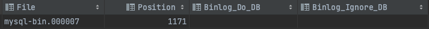
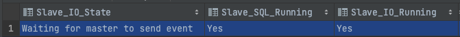
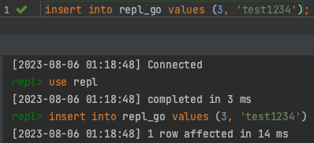
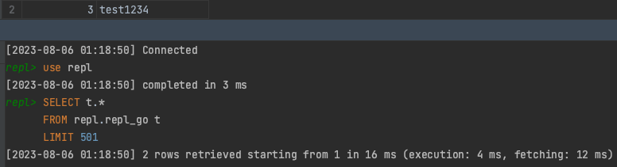

## Database Replication 에 대하여

***

#### 들어가기에 앞서
Database Replication 이란 말 그대로 Database 를 Replication (복제) 하여 똑같은 Database를 여러 대로 나누는 것이다.
(복제 된 Database 는 Replica 라고 한다.)
이는 DB 가 장애가 일어났을 때 Backup 으로서의 역할을 할 수도 있고, Query 요청을 분산함으로써 전체적인 성능 향상을 이룰 수도 있다.
이러한 장점들을 가져다주는 Database Replication 의 원리에 대해 알아보고 실제로 구축까지 진행해보자.
***

#### Our Goals
1. Database Replication 정의와 필요성을 안다.
2. Database Replication 원리를 이해하고 이에 따른 장단점을 이해한다.
3. MariaDB 로 이루어진 간단한 Primary, Secondary 구조를 구축할 수 있다.
***

<br/>
## MariaDB 에서의 Replication 방식
***
Replication 을 위해서 처음엔 똑같은 DB 내용을 가져야 하기 때문에, Replication 할 DB 를 Dump 하여 Replica 를 생성해야 한다.
그 다음 계속해서 바이너리 로그를 기반으로 하여 실시간으로 데이터 동기화가 이루어지는 구조이다.

앞으로 ***Replication 되는 DB*** 들을 ***Secondary*** 라고 하고, ***Replication 대상이 되는 DB*** 를 ***Primary*** 라고 하겠다.

보통 Primary 만 Write 가 가능하며, Secondary 들은 Read 만 가능하게 설정된다.

실시간 데이터 동기화 과정을 정리하면 다음과 같다.
1. *Primary 에서 Write 작업 시 이루어지는 트랜잭션 완료 직전에 **Binary Log** 에 변경사항 기록 후 Secondary 에 신호 전달*
2. *Primary 로 부터 신호를 전달받은 Secondary 는 생성된 Primary 의 **Binary Log** 를 **Replay Log** 에 복사*
3. *마지막으로 Secondary 가 **Replay Log** 를 읽어서 변경 사항 반영*

(2번 과정이 비동기적으로 이루어진다면 Secondary 가 Log 를 복제하여 반영하는 과정을 기다려주지 않기 때문에 데이터 정합성이 깨질수도 있다.)


- ### 바이너리 로그 기반 복제
MariaDB 의 바이너리 로그 형식은 세 가지가 존재한다.
1. ***Statement-based***
    - SQL Statement 형태로 저장
2. ***Row-based***
    - 변경이 이루어진 Row Data 자체를 base64 로 Encoding 하여 저장
    - 단순 insert/update/delete 에서 Statement-based 보다 처리 속도가 빠름
    - 대량의 데이터 수정 시 Binary Log 사이즈가 커져 문제가 발생할 수 있음
3. ***Mixed (Statement + Row)***
    - 기본적으로 Statement-based 로 저장하지만, 상황에 따라 Row-based 로 저장

단, 어떤 타입을 선택하나 **DDL** 은 SQL Statement 로 저장된다.


<br/>
## Replication 의 장단점
***
- ### 장점
    1. **Backup**
        - Primary 에 장애가 일어나서 복구가 불가능하거나 기타 문제가 생긴다면 Secondary 를 Primary 로 승격시켜 해결할 수 있다.
    2. **부하 분산**
        - 보통 **Query** 의 대부분은 **Select Statement** 로 인한 **Read** 요청이 대부분이기 때문에 이를 여러 대의 Secondary 가 나누어서
        처리하게 되면 ***성능 향상 효과***를 얻을 수 있다.
- ### 단점 (비동기형 복제의 경우)
    1. **데이터 정합성**
        - 과도한 데이터 변경 작업이 이루어 질 때 Secondary 에서 모든 변경 사항을 반영하는데 시간이 걸리기 때문에 일시적으로 
        데이터 정합성이 어긋날 가능성이 있다.
<br/>
## 실습
***

- ### 환경
    - Mac OS (M1)
    - MariaDB 11.0.2
    - Datagrip
    - Iterm

<br/>
우선 동일한 환경의 MariaDB 서버가 2대 이상 준비되어야 한다.

참고로, 필자는 로컬 환경에서 포트를 다르게 하여 준비하였다.

- ### Primary 설정
***
    1. #### `my.cnf` 설정
        ```
        [mysqld]
        log-bin = mysql-bin   # 로그 파일의 파일 명
        server-id = 2         # 서버 고유 아이디
        binlog_format = row   # 바이너리 로그 저장 형식
        expire_logs_days = 2  # 로그 보관 유효 기간
        ```
    2. #### `restart`
        `$ sudo service mysqld restart`
        - 설정 파일을 적용하려면 서버를 다시 시작해주어야 한다.
    3. #### `Secondary 사용자 계정`
        ```
        mysql>  CREATE USER '${secondary host}'@'${secondary ip}' IDENTIFIED BY '패스워드';
        mysql>  GRANT REPLICATION SLAVE ON *.* TO '${secondary host}'@'${secondary ip}' IDENTIFIED BY '패스워드';
        mysql>  FLUSH privileges;
        ```
        - secondary 에서 primary 로 접근하기 위한 계정을 생성하고 Replication 을 위한 권한을 주는 과정이다.
    4. #### `master status 확인 (바이너리 로그 저장 여부 및 Secondary 설정에 필요한 정보)`
        - `mysql> show master status;`
        
        - File 명이 잘 나오면 바이너리 로그 기록이 잘 되고 있다는 뜻이다. 그리고 File 과 Position 정보는 Secondary 설정에 필요한
        정보이다.
    5. #### `기존 데이터베이스 마이그레이션시 필요 과정`
        5-1. Primary DB Lock 걸기
            - `mysql> flush tables with read lock;`
            - Primary 와 Secondary 의 데이터를 동일하게 해야됨으로 마이그레이션 도중 일어나는 데이터 변경을 막아야 한다.

        5-2. Primary DB dump 
            - `$ mysqldump -u root -p DB명 > DB명.sql`

        5-3. Secondary DB 에 Primary DB 복사
            - `$ mysqldump -u root -p DB명 < DB명.sql`

        5-4. Primary DB Lock 풀기
            - `mysql> unlock tables;`
            - 이는 꼭!! Primary 와 Secondary 의 실시간 데이터 동기화 설정까지 마친 후 Lock 을 풀어주어야 한다.


<br/>
- ### Secondary 설정
***
    1. #### `my.cnf 설정`
        ```
        [mysqld]
        log-bin = mysql-bin
        server-id =3
        binlog_format = row
        expire_logs_days = 2
        ```

    2. #### `restart`
        - 다시 한번 강조하지만 설정을 반영하기 위해 재실행 해줘야 한다.
    3. #### `Primary 정보 입력`
        ```
        mysql > change master to master_host = 'localhost',
        master_user = 'secondary',
        master_password = '',
        master_port = 3307,
        master_log_file = 'mysql-bin.000001',
        master_log_pos = 664;
        ```
    4. #### `Secondary 활성화`
        `mysql> start slave;`
        - 위의 명령어를 실행하면 replication 을 시작하게 된다.
    5. #### `secondary status 확인`
        `mysql> show slave status;`
        
        위와 화면에서 *Slave_IO_State* 가 *Waiting for master to send event* 로 primary 의 이벤트를 기다리고 있고, Secondary 의 *SQL Thread* 와
        *IO Thread* 가 동작중임을 확인할 수 있다. 이는 곧 Replication 이 정상적으로 이루어지고 있음을 의미한다.
        
<br/>
### 동작 확인
간단하게 확인하기 위하여 최소한의 동작에 대해서 테스트 해보았다.

여기에 이용된 테이블인 **repl_test** 의 DDL 은 다음과 같다.
```SQL
create table repl_test
(
    seq      bigint       not null
        primary key,
    contents varchar(500) null
)
```
- #### write query 실행
    - `insert into repl_go values (3, 'test1234');`
    
- #### secondary 변경 사항
    

Replication 이 실시간으로 잘 이루어지고 있음을 확인 할 수 있다.


<br/>
### 마치며
***
지금까지 MariaDB 를 이용하여 Database Replication 의 원리와 장단점에 대해 알아보고 실습까지
진행해보았다. 최소한의 구조와 환경을 토대로 알아보았기 때문에 비교적 각 주제에 대해 깊게 알아보진 못하였다.
이 글에서 다루지 않은 비동기, 동기 복제 방식의 차이점과 Trade-Off, `my.cnf` 를 작성할 때 Database 설정을 좀 더 Optimizing 할 수 있는
설정 변수들에 대해선 깊게 다루지 않았다. 참고에 해당 관련 링크들을 남겨놓았으니 글들을 더 읽어보는 것이 좋다.

<br/>
### 참고
***
- [부하 분산을 위해 MySQL을 Master/Slave로 이중화를 구성해 본 이야기](https://jane096.github.io/project/mysql-master-slave-replication/)
- [MySQL Replication 구성 시 Binlog format 결정하기 – MIXED vs ROW !!](http://channy.creation.net/project/dev.kthcorp.com/2011/09/16/mysql-replication-binlog-format-mixed-vs-row/index.html)
- [MySQL Binary log의 일관성 유지](http://intomysql.blogspot.com/2010/12/mysql-binary-log.html)
- [Innodb 최적화 (MySQL)](http://coolx.net/m/cboard/read.jsp?db=develop&mode=read&num=811&_currPage=1&listCnt=20&category=-1&fval=)


