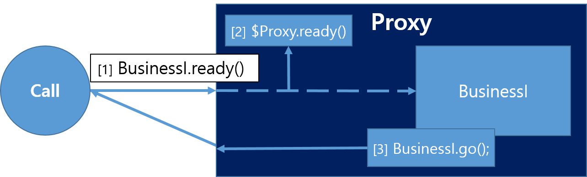

### Spring AOP 와 Self-Invocation 의 관계

***

#### 들어가기에 앞서

Self-Invocation 은 Spring AOP 동작 방식과 밀접한 연관이 있고, Spring AOP 는 보통 Cache, Transaction 을 사용할 때, 이용하게 된다.<br/>
대표적인 두 사례에서 발생하는 Self-invocation 에 대해서 알아보고, 이 문제가 발생하는 이유를 Spring AOP 의 동작 방식을 통해 이해해보고,
이를 해결하기 위한 방법들에 대해 알아보자.

***

#### Our Goals
1. Self-invocation 의 발생 원인 이해
2. 해결 방안

***

#### 1. 발생 예시 - Transaction
<br/>

##### 예제 코드

```java
@Service
public class SelfInvocationService {
    public SelfInvocationService(SelfInvocationRepository selfInvocationRepository) {
        this.selfInvocationRepository = selfInvocationRepository;
    }

    private final SelfInvocationRepository selfInvocationRepository;

    public void callApplyTransaction() {
        applyTransaction();
    }

    @Transactional
    public void applyTransaction() {
        SelfInvocation selfInvocation = new SelfInvocation();
        selfInvocationRepository.save(selfInvocation);

        System.out.println(selfInvocation.getId());
    }
}
```
<br/>
##### 테스트 코드

```java
@SpringBootTest
class SelfInvocationApplicationTests {
    @Autowired
    private SelfInvocationService selfInvocationService;

    @Test
    void transaction_self_invocation_test() {
        selfInvocationService.callApplyTransaction();
        selfInvocationService.applyTransaction();
    }
}
```

##### 결과

```
DEBUG 45279 --- [    Test worker] o.s.orm.jpa.JpaTransactionManager        : Creating new transaction with name [org.springframework.data.jpa.repository.support.SimpleJpaRepository.save]: PROPAGATION_REQUIRED,ISOLATION_DEFAULT
DEBUG 45279 --- [    Test worker] o.s.orm.jpa.JpaTransactionManager        : Creating new transaction with name [com.self.invocation.SelfInvocationService.applyTransaction]: PROPAGATION_REQUIRED,ISOLATION_DEFAULT
```

분명 이러한 코드를 실행하였을 때, 기대하는 결과는 ``applyTransaction`` 메서드에서 새로운 ***Transaction*** 이 만들어지는 것이다.
하지만 결과에는 ***Self Invocation*** 상황인 ``callApplyTransaction`` 메서드를 실행하면 ``SimpleJpaRepository.save`` 메서드에서 ***Transaction*** 이 생성 된 것으로 나왔고,
직접 `applyTransaction` 메서드를 호출하면 기대하던 결과와 같이 ``applyTransaction`` 메서드에서 ***Transaction*** 이 생성되는 것을 확인할 수 있다.

<br/>


#### 2. 발생 예시 - Cache

Cache 의 경우에도 위의 Transaction 사례와 비슷한 문제가 발생한다.
<br/>

##### 예제 코드

```java
@Service
public class SelfInvocationService {
    public SelfInvocationService(SelfInvocationRepository selfInvocationRepository) {
        this.selfInvocationRepository = selfInvocationRepository;
    }
    
    public void callApplyCache() {
        applyCache();
    }

    @Cacheable(cacheNames = "example")
    public String applyCache() {
        String caching = "caching";
        System.out.println("--- processing ---");
        return caching;
    }
}
```
<br/>
##### 테스트 코드

```java
@SpringBootTest
class SelfInvocationApplicationTests {
    @Autowired
    private SelfInvocationService selfInvocationService;

    @Test
        void cache_self_invocation_test() {
            selfInvocationService.applyCache();
            selfInvocationService.applyCache();
            selfInvocationService.callApplyCache();
        }
}

```


##### 결과

```
--- processing ---
--- processing ---
```

여기서도 원하는 결과는 `applyCache` 에서 출력하는 `--- processing ---` 이 한번만 나타나는 것이다. 하지만 결과에는 두 번 나오게 되었다.
이는 ***Self Invcation*** 상황인 `callApplyCache` 메서드를 호출하였을 때, ***Cache*** 가 동작하지 않기 때문이다. <br/>
왜 의도한 대로 결과가 나오지 않는 것일까? 답은 **프록시**를 기반으로 하는 ***Spring AOP*** 의 동작 방식과 관련에 있다.

<br/>
#### 3. 원인

위의 두 사례에서 **Spring AOP** 의 동작에 의해 메소드 호출 시 **프록시** 객체가 ***Transaction*** 과 ***Cache*** 에 맞는 부가적인 기능을 
해당 메서드 호출 전 앞 뒤에 실행하게 되는데, 이 때 해당 메서드를 호출하는 주체는 **프록시** 객체이지만, 그 안에서 다시 호출되는 메서드의 주체는 그 메서드를 갖고 있는 
객체가 된다.


위의 그림을 보면 `BusinessI.ready` 를 call 하면 프록시 객체를 참조하게 되어 `$Proxy.ready` 가 call 되고 그 다음 다시 `BusinessI`
타겟 객체를 참조하게 되는 것을 알 수 있다. 그 다음 `BusinessI.ready` 에서 call 하는 `BusinessI.go` 메서드는 `BusinessI` 에 의한 것이다.

<br/>
#### 4. 해결 방안
- AopContext 로 프록시 적용
- Self Injection
- AspectJ Weaving

이렇게 세 가지가 있는데, 본 글에서는 간단하게 적용할 수 있는 **Self Injection** 과 **AopContext** 를 이용하는 사례만 알아보고
AspectJ Weaving 에 대해서는 자세하게 다루는 글을 따로 작성하려고 한다.

##### 4.1. AopContext 로 프록시 적용

*Spring AOP* 에서는 해당 객체를 감싸고 있는 프록시 객체를 반환하는 **AopContext** 의 `currentProxy()` 메서드를 제공하고 있는데
이를 이용하는 방식이다.

```java
@Service
public class SelfInvocationService {
    public SelfInvocationService(SelfInvocationRepository selfInvocationRepository) {
        this.selfInvocationRepository = selfInvocationRepository;
    }

    private final SelfInvocationRepository selfInvocationRepository;

    public void callApplyTransaction() {

        //applyTransaction();

        ((SelfInvocationService) AopContext.currentProxy()).applyTransaction();
    }

    @Transactional
    public void applyTransaction() {
        SelfInvocation selfInvocation = new SelfInvocation();
        selfInvocationRepository.save(selfInvocation);
    }
}
```

이렇게 하게 되면 `callApplyTransaction` 를 호출 할 때 `applyTransaction` 도 프록시 객체로 실행되게 된다.
하지만 이 방법은 expose-proxy 옵션을 true 로 설정해주어야 한다.
이 설정을 하기 위해서는 XML 을 이용하는 방법, ProxyFactory 객체의 ExposeProxy 옵션을 설정해 주는 것, **Annotation** 을 활용하는 방법이 있는데
본 글에서는 Spring Boot 환경을 사용하므로 간단하게 Annotation 을 사용하는 방법만 살펴 보려고 한다.

설정 방법은 아래와 같다.
```java
@EnableAspectJAutoProxy(exposeProxy = true)
@Configuration
public class AspectJConfig {

}
```

<br/>
##### 4.2. Self Injection

Bean Container 에서 `SelfInvcationService` 자신을 다시 주입 받아, 해당 메서드를 호출하는 방식이다.
이때 주의할 점은 생성자 주입 방식이 아닌 ``@Autowired`` **Annotation** 을 통해 주입 받아야 한다는 점이다.

```java
@Service
public class SelfInvocationService {
    public SelfInvocationService(SelfInvocationRepository selfInvocationRepository) {
        this.selfInvocationRepository = selfInvocationRepository;
    }

    private final SelfInvocationRepository selfInvocationRepository;

    @Autowired
    private SelfInvocationService self;

    public void callApplyTransaction() {

//        applyTransaction();

//        ((SelfInvocationService) AopContext.currentProxy()).applyTransaction();
        self.applyTransaction();
    }

    @Transactional
    public void applyTransaction() {
        SelfInvocation selfInvocation = new SelfInvocation();
        selfInvocationRepository.save(selfInvocation);
    }
}
```
<br/>
#### 마치며

본 글에서는 Spring AOP 를 이용하며 발생할 수 있는 Self Invocation 문제에 대해 알아보았다.
그리고 몇 가지 해결 방법들을 알아보았는데, 가장 좋은 해결 방법은 Self Invocation 상황이 발생하지 않게 좋은 구조로 코드를 작성하는 것이라고 생각한다.

<br/>
#### 참고
- [Spring Docs - Proxying Mechanisms](https://docs.spring.io/spring-framework/reference/core/aop/proxying.html)
- [Moon 님 블로그 - Self Invocation은 왜 발생할까?](https://gmoon92.github.io/spring/aop/2019/04/01/spring-aop-mechanism-with-self-invocation.html)