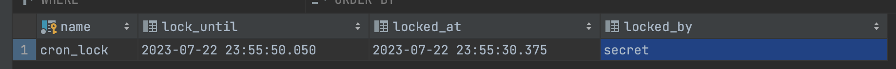
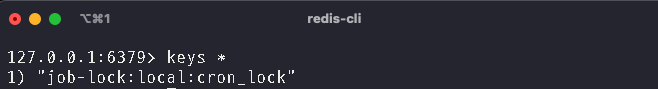
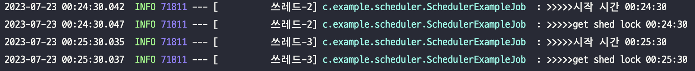
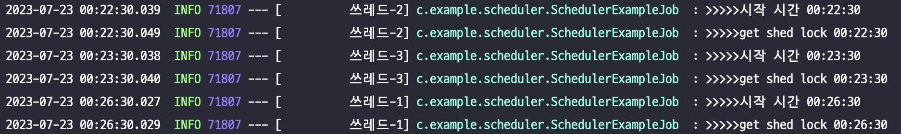

### Scale Out 상황에서의 Spring Scheduler 중복 실행 방지

***

#### 들어가기에 앞서
`Spring Scheduler` 에서는 여러 대의 인스턴스에 대한 클러스터링 기능을 제공하지 않는다.
이 때문에 서버 인스턴스가 여러 대로 늘어나는 `Scale Out` 상황에서 중복으로 실행되어 문제를 일으킬 수 있다. 이를 위해 `Lukas Krecan` 님께서 만들어주신 `Shedlock` 이라는 오픈소스 솔루션을 적용하면 문제를 해결할 수 있다.

***

#### Our Goals
1. `Shedlock` 의 적용, 사용 방법에 대한 이해
2. 상황에 맞는 적절한 `LockProvider` 선택 및 적용
***
## 설정 및 적용 과정
***

### 환경
- Spring Boot 2.5.6
- Gradle 7.6.1
- Java 11

### 적용
1. `Shedlock` 의존성 설정
2. `@EnableSchedulerLock`, `@SchedulerLock` 어노테이션 적용
3. `Lock Provider` 설정, RDB 의 경우 `Shedlock` Table 생성
<br/>
#### 의존성
```
implementation 'net.javacrumbs.shedlock:shedlock-spring:4.44.0'
implementation 'net.javacrumbs.shedlock:shedlock-provider-redis-spring:4.44.0'
implementation 'net.javacrumbs.shedlock:shedlock-provider-jdbc-template:4.44.0'
```
`shedlock` 과 `lock provider` 를 위한 의존성을 적용해준다.
본 글에서는 `lock provider` 의 Database 로 `redis`, `mariadb` 둘 다 다루어 볼 것이기 때문에 모두 추가해주었다.

*참고로 **JDK 17**, **Spring 6** 버전 이상의 환경에서는 **5.1.0** 버전을 적용해야 한다.*

<br/>
#### *@EnableSchedulerLock*, *@SchedulerLock*

`@EnableSchedulerLock`는 `@EnableScheduling`이 있는 곳에 함께 선언해주면 된다.
```java
@EnableSchedulerLock(defaultLockAtLeastFor = "40s", defaultLockAtMostFor = "50s")
@EnableScheduling
@Configuration
@RequiredArgsConstructor
public class SchedulerConfig implements SchedulingConfigurer {
}
```

`@SchedulerLock`는 **Scheduling Job** 이 수행 될 메서드에 선언해주자.
```java
@SchedulerLock(name = "cron_lock", lockAtLeastFor = "20s", lockAtMostFor = "50s")
@Scheduled(cron = CRON_EXPRESSION_EXAMPLE)
public void cron() {
    log.info(">>>>>시작 시간 {}", LocalDateTime.now().format(DATE_TIME_FORMATTER));
    log.info(">>>>>get shed lock {}", LocalDateTime.now().format(DATE_TIME_FORMATTER));
}
```

위의 코드에서 등장하는 어노테이션 옵션 값들에 대해 알아보자.

- ***name*** : `@SchedulerLock` 에 필요한 옵션 값으로 Lock Name 으로 사용 할 값이다. 다른 Job 들과 중복되지 않도록 유니크하게 설정하는 것이 중요하다.

- ***defaultLockAtLeastFor, lockAtLeastFor*** : Lock 이 유지되는 최소 시간
  - Job 의 수행 시간이 매우 빠를 때 중복 실행이 일어나는 문제를 방지할 수 있다.
- ***defaultLockAtMostFor, lockAtMostFor*** : Lock 이 유지되는 최대 시간
  - Job 의 수행 시간이 매우 길어지거나, 끝나지 않을 때 다음 순서의 Job 이 실행되지 않는 문제를 방지할 수 있다.

default 가 붙은 *defaultLockAtLeastFor*과 *defaultLockAtMostFor* 은 `@EnableSchedulerLock` 에 적용하는 값이다. 이 값은 SchedulerLock 이 걸려있지만 lockAtLeastFor 옵션이 없는 모든 Scheduling Job 에 Default 옵션으로 작용한다는 점을 주의하자.

붙지 않은 *lockAtLeastFor*, *lockAtMostFor* 은 `@SchedulerLock` 이 선언된 Job 에만 개별적으로 적용 되는 값이다.

***(LockAtLeastFor 의 값이 LockAtMostFor 값보다 크면 Exception 이 발생한다.)***

<br/>
#### Lock Provider
Shedlock 에서는 Redis, JDBC, Mongo, DynamoDB 등의 많은 Provider 를 제공하고 있다.

제공되는 Provider 들과 필요한 데이터베이스 테이블 DDL 은 [github/lukas-kracen/shedlock](https://github.com/lukas-krecan/ShedLock) 에서 확인할 수 있다.

의존성 부문에서 언급했던 것처럼 **Redis**, **JDBC** 에 대해서만 알아보자.
`Lock Provider` 는 `SchedulerConfig` 클래스에 `Bean` 으로 선언해주면 된다.

<br/>
- ##### JDBC Lock Provider
JDBC 의 경우 `Shedlock` 정보 관리를 위한 테이블을 생성해주어야 한다.
```
# MySQL, MariaDB
CREATE TABLE shedlock(name VARCHAR(64) NOT NULL, lock_until TIMESTAMP(3) NOT NULL,
    locked_at TIMESTAMP(3) NOT NULL DEFAULT CURRENT_TIMESTAMP(3), locked_by VARCHAR(255) NOT NULL, PRIMARY KEY (name));
```
본 글에서는 MariaDB 환경에서 작업이 이루어지므로 위의 DDL 을 실행하여 테이블을 생성하였다..

테이블 생성이 완료 되었으면 아래와 같이 `LockProvider` 를 등록해주자.
```java
@Bean
public LockProvider lockProvider(DataSource dataSource) {
    return new JdbcTemplateLockProvider(dataSource);
}
```
JDBC 를 사용할 것임으로 `DataSource Bean` 을 주입받아 연동해주자.

Schedling Job 이 실행되어 Lock 이 생성되면 데이터베이스에 다음과 같이 추가된다.


```java
new JdbcTemplateLockProvider(builder()
    .withTableName("shdlck")
    .withColumnNames(new ColumnNames("n", "lck_untl", "lckd_at", "lckd_by"))
    .withJdbcTemplate(new JdbcTemplate(getDatasource()))
    .withLockedByValue("my-value")
    .withDbUpperCase(true)
    .build())
```

다음과 같이 builder 를 사용하면 테이블, 스키마, 컬럼명 등을 원하는 값으로 커스터마이징 할 수 있다.

<br/>
- ##### Redis Lock Provider
```java
@Bean
public LockProvider lockProvider(RedisConnectionFactory redisConnectionFactory) {
    String lockEnv = env.getProperty("spring.profiles.active");
    return new RedisLockProvider(redisConnectionFactory, lockEnv);
}
```
`RedisConnectionFactory Bean` 을 주입 받아 연동해주면 된다.



다음과 같이 Redis 에 Key 값으로 `job-lock:${profile}:${lockName}` 형태를 가진 Lock 정보가 등록 되는 것을 확인할 수 있다.

위의 코드에서 **RedisLockProvider** 를 생성할 때 active profile 값을 가져오는데, 이 값을 넣지 않으면 `$(profile)` 값에 **default** 로 들어가게 된다.

각 환경 별로 `Redis` 서버가 나누어져 있다면 상관없지만 정보 구분을 위해 명시 하는 것이 좋다고 생각한다.

<br/>
- ##### Lock Provider 로 in-memory DB vs disk-based DB

Shedlock 은 히스토리를 남기지 않고 Lock 유지가 필요한 시간만큼 존재하다가 지워진다. 따라서 휘발성 데이터로 관리되기 때문에 in-memory DB 를 사용하는 것이 좋다.

하지만 굳이 이 Lock Provider 하나 때문에 in-memory DB 를 구축해야 하는 상황이라면
disk-based DB 를 사용하는 것 좋을 듯 하다.

## 결과
***
모든 설정과 적용을 끝냈으니 이제 몇몇 상황에 대해 테스트를 하여 결과를 확인해보자.

- ### 2개의 Instance 에서 중복 실행 확인
  - 1번 인스턴스 
  
  - 2번 인스턴스
  

  중복으로 실행을 하지 않고 사이좋게 나누어서 Job 을 수행하고 있음을 확인할 수 있다.

#### 마치며
간단한 Scheduling 작업을 위해 Spring Scheduler 를 사용하는 것은 매우 편하다.
Spring Boot Application 을 Web Server 로 띄울 때 필요한 의존성에 이미 있기 때문에 추가적으로 
설정할 게 없기 때문이다. 그리고 간단한 어노테이션과 스케줄링 옵션 적용이 주는 편리함은 크다.
하지만 클러스터링 기능이 없기 때문에 서버 인스턴스가 여러 대로 늘어날 때 중복으로 실행되는 문제가 생긴다.
이럴 때 적용할 수 있는 솔루션인 `shedlock` 에 대해서 알아보았다.

<br/>
#### 참고
- [Github Repository - shedlock](https://github.com/lukas-krecan/ShedLock)
