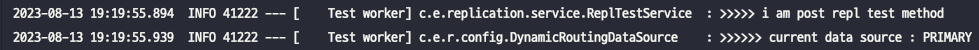

## Spring Application 에서 DB Read/Write 요청을 분산하는 법

***

#### 들어가기에 앞서
우선 Read/Write 요청을 분산하기 위해서는 Database 또한 분리되어 있어야 한다. 이는 즉 Database Replication 이 필요하다는 의미이다.
이에 대해선 이전에 다룬적이 있는데 [Database Replication 은 왜 하는걸까?](https://minhye0k.github.io/database-replication-%EC%9D%80-%EC%99%9C-%ED%95%98%EB%8A%94%EA%B1%B8%EA%B9%8C-with-maria-db) 를 통해 확인할 수 있다.
이렇게 분리된 Database 와 함께 Spring Application 에서 `@Transactional` 의 `readOnly` 힌트를 이용해 Read/Write 요청을 알맞게 분산시킬 수 있다.

지금부터 어떻게 동작이 이루어지는지에 대해 알아보고 실제로 구현까지 진행해보자.

***

#### Our Goals
1. DataSource Routing 이 어떻게 이루어지는지 이해한다.
2. Read/Write 요청을 분산시키기 위한 DataSource Routing 을 구현할 수 있다.
***

## 구현 과정
***
- ### 환경
    - Spring Boot 2.5.6
    - MariaDB 11.0.2
    - Spring Data JPA

- ### Read/Write DataSource Bean 생성
    - ***yml 에 Database 정보 입력***
        ```yml
        spring:
            datasource:
                hikari:
                    primary:
                        jdbc-url: jdbc:mariadb://localhost:3307/test
                        username: root
                        driver-class-name: org.mariadb.jdbc.Driver
                    secondary:
                        jdbc-url: jdbc:mariadb://localhost:3308/test
                        username: root
                        driver-class-name: org.mariadb.jdbc.Driver
        ```
        primary 와 secondary 를 연동하기 위해 각각의 `url`, `username`, `driver-class-name` 를 입력해주자.
        만약 `password` 가 설정되어 있다면 추가로 입력해주어야 한다.
    - ***DataSource Bean 설정***
        ```java
        @Configuration
        public class DataSourceConfig {
            @ConfigurationProperties(prefix = "spring.datasource.hikari.primary")
            @Bean
            public DataSource primaryDataSource() {
                return DataSourceBuilder.create().type(HikariDataSource.class).build();
            }

            @ConfigurationProperties(prefix = "spring.datasource.hikari.secondary")
            @Bean
            public DataSource secondaryDataSource() {
                return DataSourceBuilder.create().type(HikariDataSource.class).build();
            }

            ...(생략)
        } 

        ```
        `yml` 에 설정해주었던 정보를 기반으로 Bean 을 등록해주자.

- ### AbstractRoutingDataSource 설정 및 적용
    ```java
    public class DynamicRoutingDataSource extends AbstractRoutingDataSource {

        @Override
        protected Object determineCurrentLookupKey() {
            return isCurrentTransactionReadOnly() ? SECONDARY : PRIMARY;
        }
    }
    ```
    `AbstractRoutingDataSource` 을 상속받아 `determineCurrentLooupKey()` 를 Overriding 하여 현재 Transaction 의 readOnly
    값에 따라 적절한 DataSource 를 찾아서 연결할 수 있도록 하였다.

    이렇게 만든 `DynamicRoutingDataSource` 를 적용해 줄 차례이다.
    ```java
    @Configuration
    public class DataSourceConfig {
        ...(생략)
        @DependsOn({"primaryDataSource", "secondaryDataSource"})
        @Bean
        public DataSource routingDataSource(
                @Qualifier("primaryDataSource") DataSource primary,
                @Qualifier("secondaryDataSource") DataSource secondary) {
            DynamicRoutingDataSource routingDataSource = new DynamicRoutingDataSource();

            Map<Object, Object> dataSourceMap = new HashMap<>();

            dataSourceMap.put(PRIMARY, primary);
            dataSourceMap.put(SECONDARY, secondary);

            routingDataSource.setTargetDataSources(dataSourceMap);
            routingDataSource.setDefaultTargetDataSource(primary);

            return routingDataSource;
        }

        @DependsOn({"routingDataSource"})
        @Primary
        @Bean
        public DataSource dataSource(DataSource routingDataSource) {
            return new LazyConnectionDataSourceProxy(routingDataSource);
        }

        ...(생략)
    }
    ```

    위의 코드와 같이 `RoutingDataSource` Bean 을 위에서 만든 클래스를 적용하여 등록해주고 이렇게 등록된 것을 다시
    `LazyConnectionDataSourceProxy` 로 감싸서 `DataSource` Bean 을 등록해주면 된다.

    여기서 주의할 점은 `dataSource` 에 `@Primary` 애너테이션을 달아주어 기본 `DataSource` 로 Bean 이 등록되게 해주자.
    이렇게 해야 `DataSource` 주입이 필요한 다른 Bean (ex. `EntityManagerFactory`) 이 정상적으로 생성되어 작동 할 수 있다.

    근데 `LazyConnectionDataSourceProxy` 는 무슨 역할을 하는걸까?

 - ### LazyConnectionDataSourceProxy
    Spring 에서는 Transaction 에 접근 하는 순간 DataSource 의 커넥션을 가져온다. 
    이러면 우리가 원했던 DataSource 분기 처리가 이루어지지 않는다.

    이러한 이유로 Transaction 이 시작되고 나서 실제 Query 가 실행될 때 DataSource 를 결정하도록 해야 하는데
    이 역할을 하는것이 바로 `LazyConnectionDataSourceProxy` 이다.
    
    자세한 내용은 참고에 남긴 글에서 확인하면 좋다.
- ### TransactionManager 설정
    본 글에서는 JPA 를 사용하기 때문에, `jpaTransactionManager` 를 설정해주었다.

    ```java
    @Configuration
    public class DataSourceConfig {
        ...(생략)

        @Bean
        public PlatformTransactionManager transactionManager(EntityManagerFactory entityManagerFactory){
            JpaTransactionManager jpaTransactionManager = new JpaTransactionManager();
            jpaTransactionManager.setEntityManagerFactory(entityManagerFactory);
            return jpaTransactionManager;
        }
    }
    ```
<br/>
## 결과 확인
***
분기가 잘 이루어지는지 확인하기 위해 `DynamicRoutingDataSource` 에 아래와 같이 로그를 찍어 확인하였다.

```
@Slf4j
public class DynamicRoutingDataSource extends AbstractRoutingDataSource {

    @Override
    protected Object determineCurrentLookupKey() {
        String dataSourceName = isCurrentTransactionReadOnly() ? SECONDARY : PRIMARY;
        log.info(">>>>>> current data source : {}", dataSourceName);  
        return dataSourceName;
    }
}
```

- ### 테스트 코드
    간단한 테스트를 위해 readOnly 설정된 Transaction 과 설정되지 않은 Transaction 에 대한 메서드를 만들었다.
    ```java
    @Service
    @RequiredArgsConstructor
    public class ReplTestService {
        private final static String TEST = "TEST";
        private final ReplTestRepository replTestRepository;

        @Transactional
        public void postReplTest(){
            log.info(">>>>> i am post repl test method");
            replTestRepository.save(ReplTest.of(TEST));
        }

        @Transactional(readOnly = true)
        public void getReplTest(){
            log.info(">>>>> i am get repl test method");
            replTestRepository.findAll();
        }
            
    }
    ```

    그 다음 결과를 확인하기 위해 위의 코드에 대한 테스트 코드를 작성하였다.
    ```java
    @SpringBootTest
    class ReplicationApplicationTests {
        @Autowired
        private ReplTestService replTestService;

        @Test
        void 쓰기_전용() {
            replTestService.postReplTest();
        }

        @Test
        void 읽기_전용() {
            replTestService.getReplTest();
        }
    }

    ```
- ### Primary (쓰기 전용) 연결 
    
- ### Secondary (읽기 전용) 연결
    
    

<br/>
## 마치며
***
write/read Query 를 분산하기 위한 Spring 에서의 DataSource 분기에 대해 알아보았다.

이외에도 데이터베이스 분산 환경에서 Multi DataSource 가 필요할때도 이러한 분기 처리를 적용할 수 있다.

이 글의 전체 코드는 [여기](https://github.com/minhye0k/blog-code/tree/main/replication) 에서 확인할 수 있다.

<br/>
## 참고
***
- [LazyConnectionDataSourceProxy 알아보기](https://sup2is.github.io/2021/07/08/lazy-connection-datasource-proxy.html)