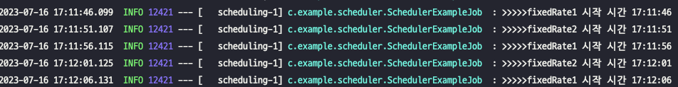
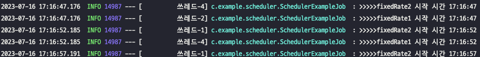
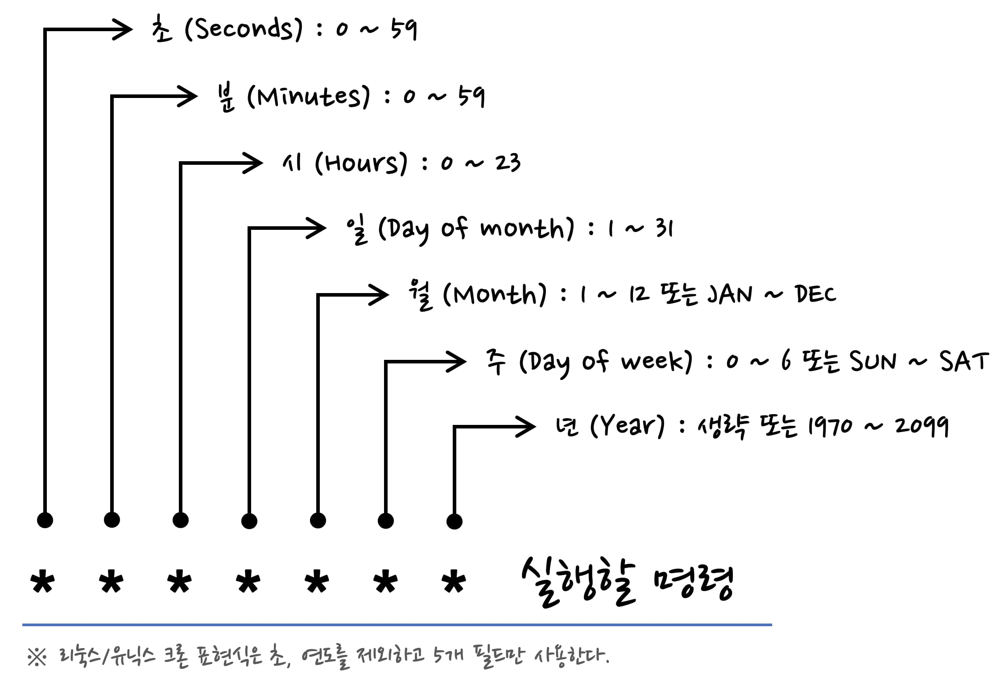
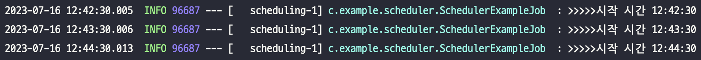
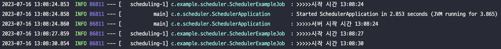
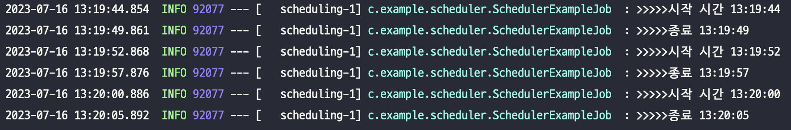
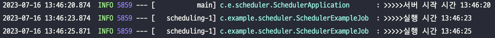
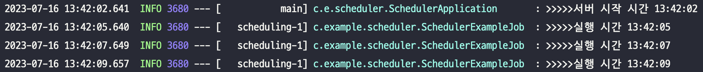

## Spring Scheduler 를 활용한 작업 Scheduling

***

#### 들어가기에 앞서

짧은 간격으로 주기적으로 이루어져야 하는 작업들이 있다. 이때 Spring Batch 를 떠올릴 수 있지만,
매우 간단하거나 실행 되어야 하는 주기가 10분, 30분, 1시간 정도로 짧은 편에 속하며 처리하는 데이터의 수가 매우 많지 않다면
Spring Batch 를 적용하는 것이 부담스럽고, 이는 곧 비교적 과도한 리소스 소모에 대한 걱정으로 이어질 수 있다.
이럴 때 적절하게 적용할 수 있는 Spring Scheduler 에 대해서 알아보자.

***

#### Our Goals
1. Spring Scheduler 동작에 대한 이해
2. Spring Scheduler 적용 방법
3. 주의 할 점

***

## 설정

### 환경

- Spring Boot 2.5.6
- Gradle 7.6.1
- Java 11
<br/>
### 의존성
```
dependencies {
    implementation 'org.springframework.boot:spring-boot-starter-web'
}
```
이 의존성에 Spring Scheduler(org.springframework.scheduling) 가 포함되어 있다.

### 활성화

어플리케이션 메인 클래스에 `@EnableScheduling` 어노테이션을 달아서 Spring Scheduler 를 사용할 것임을 어플리케이션에게 알려주어야 한다.
```java
@EnableScheduling
@SpringBootApplication
public class SchedulerApplication {
	
	public static void main(String[] args) {
		SpringApplication.run(SchedulerApplication.class, args);
	}
}
```

그리고 실제 수행되어야 할 메서드에 스케줄링 옵션 값과 함께 `@Scheduled` 어노테이션을 달아주어야 하고
메서드의 클래스는 Bean 으로 등록되어야 한다.

스케줄링 작동에 필요한 모든 준비가 완료 된 클래스와 메서드의 형태는 아래와 같다.
```java
@Slf4j
@Component
public class SchedulerExampleJob {
    private static final String CRON_EXPRESSION_EXAMPLE = "30 * * * * *";

    @Scheduled(cron = CRON_EXPRESSION_EXAMPLE)
    public void cron() {
        log.info(">>>>>시작 시간 {}", LocalDateTime.now().format(DATE_TIME_FORMATTER));
    }
}
```
예제라서 간단하게 구현했지만, 실제 수행되어야 하는 비즈니스 로직은 다른 Bean 의 메서드로 분리하는게 좋다. 즉 다시 말해, 
스케줄링 하여 작업을 실행하는 Bean 과 비즈니스 로직을 수행하는 Bean 이 분리된 형태이다. 

비즈니스 로직에는 `@Transactional` 이나 `@Async` 와 같은 어노테이션을 붙여 추가적인 기능들을 필요로 하는 경우가 많은데
이런 어노테이션들을 @Scheduled 와 같은 메소드에 선언하게 되면
`@Scheduled` 어노테이션에 의한 동작과 충돌을 일으킬 수 있기 때문이다. 또한 객체의 역할,책임 관점에서도 분리하는게 좋은데
자세한 내용은 다른 포스팅에서 다루어 볼 예정이다.

### Thread Pool
Default 로 Scheduler 에 사용되는 Thread Pool의 사이즈는 1이다. 이렇게 되면 특정 작업이 제 시간에 동작하지 않고
이미 작업중인 것이 끝날 때까지 기다려야 한다는 문제가 발생한다.

```java
@Scheduled(fixedRate = 3000)
public void fixedRate1() throws InterruptedException {
    log.info(">>>>>fixedRate1 시작 시간 {}", LocalDateTime.now().format(DATE_TIME_FORMATTER));
    Thread.sleep(5000);
}

@Scheduled(fixedRate = 3000)
public void fixedRate2() throws InterruptedException {
    log.info(">>>>>fixedRate2 시작 시간 {}", LocalDateTime.now().format(DATE_TIME_FORMATTER));
    Thread.sleep(5000);
}
```

위의 메소드들은 각각 따로 3초마다 실행되어야 하지만 이용할 수 있는 Thread가 1개이다 보니 이전 작업의 종료까지 기다리기 때문에
5초마다 번갈아가며 수행된다.



따라서 상황과 여건에 맞게 적절한 Thread Pool 사이즈를 설정하는 작업이 필요하다.

`application.properties` 에 다음과 같이 값을 설정할 수 있다.

``
spring.task.scheduling.pool.size=5
``

혹은 Configuration 클래스를 만들어서 정의할 수도 있다.
```java
@Configuration
public class SchedulerConfig implements SchedulingConfigurer {
    private static final int POOL_SIZE = 5;

    @Override
    public void configureTasks(ScheduledTaskRegistrar taskRegistrar) {
        ThreadPoolTaskScheduler threadPoolTaskScheduler = new ThreadPoolTaskScheduler();
        threadPoolTaskScheduler.setPoolSize(POOL_SIZE);
        threadPoolTaskScheduler.setThreadNamePrefix("쓰레드-");
        threadPoolTaskScheduler.initialize();

        taskRegistrar.setTaskScheduler(threadPoolTaskScheduler);
    }
}
```

설정 한 후 다시 작업을 실행시키면



다음과 같이 적절하게 여러 Thread 중 쉬고있는 하나를 선택하여 실행되는 것을 확인할 수 있다.
## 스케줄링
지원되는 스케줄링 방식에는 여러가지가 있는데 Cron 부터 천천히 알아보자.
참고로 앞으로 나오는 결과 화면에서 등장하는 시간 형식은 `HH:mm:ss` 이다.

### Cron

(출처 : [크론 표현식(Cron Expressions)](https://madplay.github.io/post/a-guide-to-cron-expression))

Cron Expression 은 위의 사진을 참고하면 이해하기 쉬울 것이다. 더 자세한 것이 알고 싶다면 출처 링크로 가보는 것을 추천한다.
Cron Expression 을 이용하면 특정 날짜, 시간 등을 지정할 수 있으며 매 시간마다, 일요일마다와 같은 주기를 설정할 수도 있다.
```java
private static final String CRON_EXPRESSION_EXAMPLE = "30 * * * * *";

@Scheduled(cron = CRON_EXPRESSION_EXAMPLE)
public void cron() {
    log.info(">>>>>시작 시간 {}", LocalDateTime.now().format(DATE_TIME_FORMATTER));
}
```

위 코드는 매분 30초 마다 실행되게 Cron Expression 을 적용한 것이다.



의도한 대로 매분 30초에 잘 실행되는 것을 확인할 수 있다. 
<br/>
### Fixed Rate
Fixed Rate 는 말 그대로 고정된 간격으로 실행을 해주는 것이다.
fixedRate 값은 millisecond 단위이기 때문에 3000ms 주어 3초마다 실행되게 하였다.
```
@Scheduled(fixedRate = 3000)
public void fixedRate(){
    log.info(">>>>>시작 시간 {}", LocalDateTime.now().format(DATE_TIME_FORMATTER));
}
```

서버 시작과 동시에 실행되며 이후 3초의 간격으로 실행되는 것을 확인할 수 있다.


### Fixed Delay
Fixed Delay 는 고정된 Delay 간격으로 실행이 이루어진다. 이는 Delay 기 때문에 앞의 작업이 끝난 이후부터 시간이 계산된다.
다시 말해, fixedDelay 가 3초이고 메서드의 수행 시간이 5초라면 작업 실행 과정은 다음처럼 될 것을 기대할 수 있다.

1. 0초 -> 1번 작업 시작
2. 5초 -> 1번 작업 종료
3. 8초 (5 + 3) -> 2번 작업 시작

```java
@Scheduled(fixedDelay = 3000)
    public void fixedDelay() throws InterruptedException {
    log.info(">>>>>시작 시간 {}", LocalDateTime.now().format(DATE_TIME_FORMATTER));
    Thread.sleep(5000);
    log.info(">>>>>종료 {}", LocalDateTime.now().format(DATE_TIME_FORMATTER));
}
```

Thread 를 잠시 잠재워서 메서드 수행시간이 약 5초가 되게 하였다.



위에서 기대했던 바와 같이 잘 동작하는 것을 확인할 수 있다.

### Initial Delay
Initial Delay 는 스케줄링 작업이 등록된 다음 얼만큼의 Delay후에 작업이 실행될건지에 대한 Delay를 정하는 것이다.
설정을 안하게 되면 default 값이 1L 이기 때문에 스케줄링 작업이 등록되는 시점에 바로 실행된다.

이 환경에서는 서버가 실행될 때 스케줄링 작업이 바로 등록된다.

fixedDelay, fixedRate 와 함께 적용하는 것이 가능하다.


Cron Expression 과 함께 적용하는 것은 지원되지 않는 것으로 확인된다.
<br/>
#### fixedRate With Initial Delay

initialDelay 3초와 fixedDelay 2초의 값을 주고 실행해보았다.

```java
@Scheduled(fixedRate = 2000, initialDelay = 3000)
public void initialDelayWithFixedRate() {
    log.info(">>>>>실행 시간 {}", LocalDateTime.now().format(DATE_TIME_FORMATTER));
}
```

서버 시작 시간(스케줄링 작업 등록 시점)으로부터 3초의 Delay 를 갖고 작업이 시작되는 것을 확인 할 수 있다.

#### fixedDelay With Initial Delay
위의 fixedRate 와 같은 시간 옵션을 주었다.

```java
@Scheduled(fixedDelay = 2000, initialDelay = 3000)
public void initialDelayWithFixedDelay() {
    log.info(">>>>>실행 시간 {}", LocalDateTime.now().format(DATE_TIME_FORMATTER));
}
```


위의 fixedRate 때와 같은 동작을 올바르게 하는 것을 확인 할 수 있다.
### 주의 할 점
- 스케줄링 작업 메서드에는 인자값이 없어야 한다.
- 서버 인스턴스가 2대 이상이라면 스케줄링 작업이 각 인스턴스에서 독립적으로 수행되기 때문에 중복 작업이 이루어질 수 있다.
이를 방지하기 위해서는 `Shedlock` 을 적용해야 하는데 자세한 내용은 다음 포스팅에서 다루어 볼 예정이다.
- Thread Pool 의 사이즈는 CPU Bound 작업인지 I/O Bound 작업인지 그리고 애플리케이션에서 사용 가능한 CPU 코어의 수 등
여러 조건에 기반해 적절하게 설정해야 한다.


### 마치며
Spring Scheduler 의 동작 방식과 적용 과정 그리고 주의해야 할 점 들에 대해 알아보았다. 
자칫하면 Spring Batch, Spring Quartz 와 혼동할 수 있는데
각각의 기술들에 대해 장단점과 적용하는 이유와 실행되어야 하는 작업의 규모를 잘 인지하여
적절한 기술을 적용하는 것이 중요하다. 이 포스팅에 등장한 코드들이 존재하는 프로젝트는 
[전체 코드](https://github.com/minhye0k/blog-code/tree/main/scheduler)에서 확인할 수 있다.